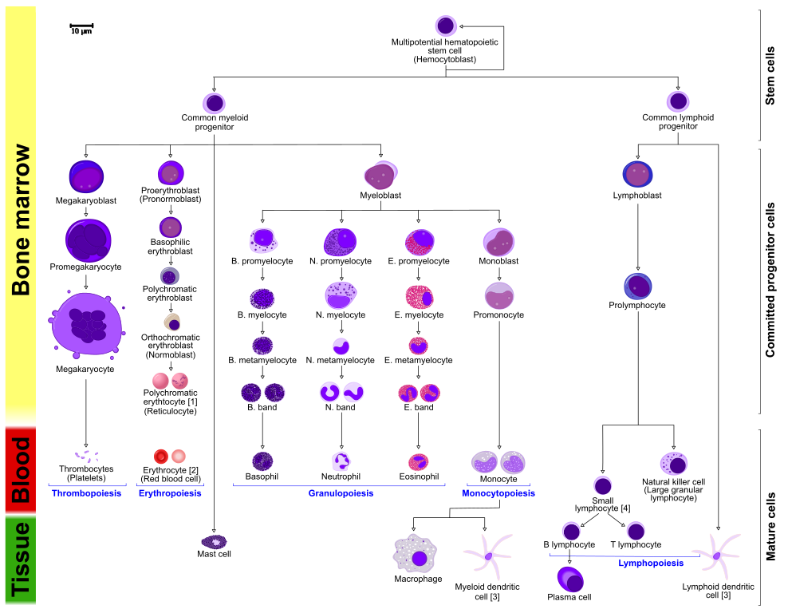

# immunepy

>  Human immune system abstracted using Python and object-oriented programming

**Contents**

- [Installation](#installation)
- [Abstraction](#abstraction)

## Installation

```
git clone https://github.com/erictleung/immunepy.git
cd immunepy
pip install .
```

## Abstraction


